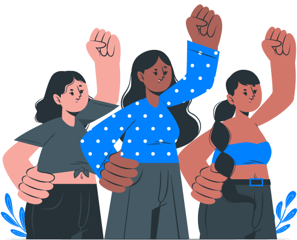

# Elas por Elas

*"Sua Força e Segurança a um toque de distância"*

O **Elas por Elas** é uma plataforma digital dedicada a ser uma aliada na segurança feminina, oferecendo um ambiente seguro e acolhedor onde mulheres podem encontrar apoio, informação e recursos para combater a violência. O projeto foi idealizado e desenvolvido por estudantes de Análise e Desenvolvimento de Sistemas da UNIT PE.

## Sobre o Projeto

Nossa missão é conectar, proteger e fortalecer mulheres através da tecnologia. Acreditamos que, ao facilitar o acesso à ajuda e unir forças, podemos criar uma rede de proteção eficaz e solidária. A plataforma centraliza funcionalidades essenciais de segurança, permitindo que as usuárias ajam de forma rápida, segura e, se preferirem, anônima.

## Funcionalidades Principais

O "Elas por Elas" conta com uma série de funcionalidades pensadas para garantir o amparo e a segurança de suas usuárias:

* **Denúncias Seguras**: Usuárias podem registrar ocorrências de forma identificada ou anônima, com a opção de anexar evidências como fotos, áudios e vídeos.
* **Mapa de Postos Próximos**: Uma ferramenta de geolocalização, construída com a biblioteca Leaflet.js, que exibe as delegacias e centros de apoio mais próximos, facilitando a busca por ajuda presencial.
* **Detalhes dos Postos de Apoio**: Informações completas sobre os postos, incluindo endereço, status de funcionamento (ex: "Aberto 24 horas"), site e opções como "Salvar Local" e "Ver Rotas".
* **Sistema de Contas**: As usuárias podem criar uma conta para ter acesso a funcionalidades exclusivas ou utilizar os recursos de denúncia anônima sem a necessidade de login.
* **Central de Ajuda (FAQ)**: Uma seção completa com respostas para as dúvidas mais comuns sobre o uso da plataforma, segurança de dados e funcionamento das denúncias.
* **Suporte Multilíngue**: A interface está totalmente disponível em Português (pt-br) e Inglês (en), garantindo maior acessibilidade.

## Tecnologias Utilizadas

Este projeto foi construído utilizando tecnologias web modernas e focadas em uma experiência de usuário responsiva e acessível:

* **HTML5**
* **CSS3** (com variáveis, Flexbox e Grid Layout)
* **JavaScript** (para interatividade e manipulação do DOM)
* **Leaflet.js**: Biblioteca JavaScript para a criação de mapas interativos.
* **Google Fonts**: A fonte "Poppins" foi utilizada para garantir um design limpo e legível.

## Autores

Este projeto foi concebido e desenvolvido com dedicação por uma equipe de estudantes de Análise e Desenvolvimento de Sistemas:

* **Eduarda Santana**
    * [LinkedIn](https://www.linkedin.com/in/eduarda-santana-6222b3326/)
    * [GitHub](https://github.com/eduard4-sant)
* **Gabriel Pereira**
    * [LinkedIn](https://www.linkedin.com/in/gabriel-pereira0w/)
    * [GitHub](https://github.com/Gabriel05-gif)
* **Júlio César**
    * [LinkedIn](https://www.linkedin.com/in/j%C3%BAlioc%C3%A9sarlk/)
    * [GitHub](https://github.com/JulioC3sarDev)
* **Lucas Nascimento**
    * [LinkedIn](https://www.linkedin.com/in/lucas-nascimento-dev27/)
    * [GitHub](https://github.com/LNS127)
* **Nathaly Ferreira**
    * [LinkedIn](https://www.linkedin.com/in/nathaly-ferreira-484704232/)
    * [GitHub](https://github.com/FSPNathaly)
